# 🚀 Osool Phase 1 Deployment Documentation

**Welcome to the Osool deployment guide!** This directory contains everything you need to deploy your AI-powered real estate platform to production.

---

## 📚 Documentation Overview

| File | Purpose | When to Use |
|------|---------|-------------|
| **[QUICK_START_DEPLOY.md](QUICK_START_DEPLOY.md)** | 30-minute quick deployment | Start here if you're ready to deploy now |
| **[PHASE1_DEPLOYMENT_ACTION_PLAN.md](PHASE1_DEPLOYMENT_ACTION_PLAN.md)** | Detailed step-by-step guide | Use for comprehensive instructions |
| **[DEPLOYMENT_CHECKLIST.md](DEPLOYMENT_CHECKLIST.md)** | Interactive checklist | Track your progress as you deploy |
| **[GENERATE_KEYS.md](GENERATE_KEYS.md)** | Security key generation | Generate JWT, encryption keys, and API keys |
| **[RAILWAY_ENV_TEMPLATE.txt](RAILWAY_ENV_TEMPLATE.txt)** | Backend environment variables | Copy/paste template for Railway |
| **[VERCEL_ENV_TEMPLATE.txt](VERCEL_ENV_TEMPLATE.txt)** | Frontend environment variables | Copy/paste template for Vercel |
| **[DEPLOYMENT_GUIDE.md](DEPLOYMENT_GUIDE.md)** | Original deployment guide | Alternative reference |

---

## 🎯 What You're Deploying

### Phase 1: AI Chatting & Selling with AMR Agent

**AMR (Advanced Multi-Reasoning)** is your one-of-a-kind AI sales agent powered by Claude 3.5 Sonnet that:

✅ Engages customers in natural conversation
✅ Understands property requirements intelligently
✅ Retrieves relevant properties from vector database
✅ Provides personalized recommendations
✅ Maintains conversation context across sessions
✅ Handles complex queries about Egyptian real estate

### Technology Stack

```
┌─────────────────────────────────────────────────────────┐
│                   USER BROWSER                          │
└─────────────────────────────────────────────────────────┘
                          ↓
┌─────────────────────────────────────────────────────────┐
│  VERCEL PRO - Frontend (Next.js 16)                     │
│  • React 19 UI                                          │
│  • Framer Motion animations                             │
│  • ThirdWeb wallet integration                          │
│  • Real-time chat interface                             │
└─────────────────────────────────────────────────────────┘
                          ↓
┌─────────────────────────────────────────────────────────┐
│  RAILWAY PRO - Backend (FastAPI)                        │
│  • Python 3.10                                          │
│  • Claude 3.5 Sonnet (AMR Agent)                        │
│  • OpenAI Embeddings (Vector search)                    │
│  • PostgreSQL database                                  │
│  • Sentry error tracking                                │
│  • Circuit breakers & rate limiting                     │
└─────────────────────────────────────────────────────────┘
                          ↓
┌─────────────────────────────────────────────────────────┐
│  EXTERNAL SERVICES                                      │
│  • Supabase (Vector store for RAG)                      │
│  • OpenAI API (Embeddings)                              │
│  • Anthropic API (Claude/AMR)                           │
└─────────────────────────────────────────────────────────┘
```

---

## 🚦 Deployment Path: Choose Your Journey

### 🏃 Fast Track (30 minutes)
**For:** Developers who want to deploy ASAP
**Start with:** [QUICK_START_DEPLOY.md](QUICK_START_DEPLOY.md)

Steps:
1. Generate security keys
2. Deploy to Railway
3. Deploy to Vercel
4. Connect and test

---

### 🚶 Guided Path (60 minutes)
**For:** First-time deployers or those who want detailed explanations
**Start with:** [PHASE1_DEPLOYMENT_ACTION_PLAN.md](PHASE1_DEPLOYMENT_ACTION_PLAN.md)

Steps:
1. Read full deployment plan
2. Use [DEPLOYMENT_CHECKLIST.md](DEPLOYMENT_CHECKLIST.md) to track progress
3. Follow each step carefully
4. Verify at each stage

---

### 📋 Checklist Only (Variable time)
**For:** Experienced deployers who just need a checklist
**Start with:** [DEPLOYMENT_CHECKLIST.md](DEPLOYMENT_CHECKLIST.md)

Check off items as you complete them.

---

## 🔑 Prerequisites

### Required Accounts (Free to create, Pro plans needed)
- [x] **Railway Pro** - $20/month - Backend hosting
- [x] **Vercel Pro** - $20/month - Frontend hosting
- [ ] **GitHub Account** - Free - Repository: `Mustafa6066/Osool`
- [ ] **OpenAI Account** - Pay-as-you-go - Embeddings
- [ ] **Anthropic Account** - Pay-as-you-go - Claude AMR
- [ ] **Supabase Account** - Free tier works - Vector database

### Required Knowledge
- Basic Git/GitHub usage
- Understanding of environment variables
- Basic command line usage (for generating keys)

### Required Tools (Local Development)
- Python 3.10+ (for generating encryption keys)
- Git (for version control)
- Password Manager (for storing secrets)

---

## 💰 Estimated Monthly Costs

| Service | Cost | Notes |
|---------|------|-------|
| **Railway Pro** | $20/month | Backend hosting, includes PostgreSQL |
| **Vercel Pro** | $20/month | Frontend hosting, includes analytics |
| **OpenAI API** | ~$10-30/month | Embeddings (usage-based) |
| **Anthropic API** | ~$20-50/month | Claude AMR (usage-based) |
| **Supabase** | Free | Vector store (free tier sufficient for Phase 1) |
| **Total** | **~$70-120/month** | Varies with user traffic |

---

## 📊 Deployment Steps Overview

```mermaid
graph TD
    A[Start] --> B[Generate Security Keys]
    B --> C[Deploy Backend to Railway]
    C --> D[Add PostgreSQL Database]
    D --> E[Configure Environment Variables]
    E --> F[Deploy Frontend to Vercel]
    F --> G[Connect Services CORS]
    G --> H[Test End-to-End]
    H --> I{All Tests Pass?}
    I -->|Yes| J[✅ Deployment Complete]
    I -->|No| K[Check Logs & Troubleshoot]
    K --> H
```



---

## 🎯 Quick Reference

### Generate Keys
```bash
# JWT Secret
python -c "import secrets; print(secrets.token_hex(32))"

# Wallet Encryption Key
python -c "from cryptography.fernet import Fernet; print(Fernet.generate_key().decode())"
```

### Health Check URLs (After Deployment)
```
https://YOUR_RAILWAY_URL/health
https://YOUR_RAILWAY_URL/health/detailed
https://YOUR_RAILWAY_URL/health/version
https://YOUR_RAILWAY_URL/health/costs
```

### Expected Response
```json
{
  "status": "healthy",
  "timestamp": "2026-01-13T12:00:00Z",
  "database": "connected",
  "ai_service": "ready"
}
```

---

## 🚨 Troubleshooting Quick Reference

| Problem | Solution | Details |
|---------|----------|---------|
| Frontend 404 errors | Check `NEXT_PUBLIC_API_URL` | Must match Railway URL exactly |
| Backend 500 errors | Check Railway logs | Usually missing env variables |
| CORS errors | Update `FRONTEND_DOMAIN` | Must match Vercel URL exactly |
| AI doesn't respond | Check API keys | Verify Anthropic key is valid |
| Build fails | Check root directory | Railway: `backend`, Vercel: `web` |

---

## 📈 Post-Deployment

### Immediate Actions
1. ✅ Test AI chat with multiple queries
2. ✅ Verify authentication flow
3. ✅ Check all health endpoints
4. ✅ Monitor Railway metrics
5. ✅ Enable Vercel Analytics

### First Week
1. Monitor error rates (Sentry if enabled)
2. Check API costs daily
3. Review user feedback
4. Optimize slow queries
5. Set up alerts for downtime

### Ongoing
1. Weekly health checks
2. Monthly cost reviews
3. Update dependencies
4. Monitor security advisories
5. Plan Phase 2 features

---

## 🔐 Security Best Practices

### Environment Variables
- ✅ **NEVER** commit `.env` files to Git
- ✅ Use Railway's built-in secrets management
- ✅ Rotate API keys every 90 days
- ✅ Use different keys for dev and production

### Access Control
- ✅ Enable 2FA on Railway and Vercel
- ✅ Limit team access to production
- ✅ Review API usage regularly for anomalies
- ✅ Use password manager for all secrets

### Monitoring
- ✅ Set up uptime monitoring
- ✅ Configure error alerts
- ✅ Monitor API rate limits
- ✅ Track cost metrics

---

## 🎓 Learning Resources

### Official Documentation
- [Railway Docs](https://docs.railway.app/)
- [Vercel Docs](https://vercel.com/docs)
- [FastAPI Docs](https://fastapi.tiangolo.com/)
- [Next.js Docs](https://nextjs.org/docs)

### API Documentation
- [OpenAI API](https://platform.openai.com/docs)
- [Anthropic API](https://docs.anthropic.com/)
- [Supabase Docs](https://supabase.com/docs)

---

## 🤝 Support

### If Something Goes Wrong

1. **Check the logs first**
   - Railway: Dashboard → Deployments → View Logs
   - Vercel: Dashboard → Deployments → Build Logs
   - Browser: DevTools → Console

2. **Review the guides**
   - [PHASE1_DEPLOYMENT_ACTION_PLAN.md](PHASE1_DEPLOYMENT_ACTION_PLAN.md) - Troubleshooting section
   - [QUICK_START_DEPLOY.md](QUICK_START_DEPLOY.md) - Quick fixes

3. **Verify environment variables**
   - Use [RAILWAY_ENV_TEMPLATE.txt](RAILWAY_ENV_TEMPLATE.txt)
   - Use [VERCEL_ENV_TEMPLATE.txt](VERCEL_ENV_TEMPLATE.txt)

---

## ✅ Success Criteria

Your deployment is successful when:

- [ ] Backend health endpoint returns 200 OK
- [ ] Frontend loads without errors
- [ ] AI chat responds intelligently
- [ ] Authentication flow works
- [ ] No CORS errors in console
- [ ] Railway dashboard shows healthy service
- [ ] Vercel deployment is successful
- [ ] AMR agent retrieves property data
- [ ] Conversation context is maintained

---

## 🚀 Ready to Deploy?

Choose your path:

1. **Quick Deploy** → [QUICK_START_DEPLOY.md](QUICK_START_DEPLOY.md)
2. **Detailed Guide** → [PHASE1_DEPLOYMENT_ACTION_PLAN.md](PHASE1_DEPLOYMENT_ACTION_PLAN.md)
3. **Just Checklist** → [DEPLOYMENT_CHECKLIST.md](DEPLOYMENT_CHECKLIST.md)

---

## 📝 Deployment Log

After successful deployment, record your details:

```
Deployment Date: __________
Frontend URL: https://_____________________.vercel.app
Backend URL: https://_____________________.up.railway.app
Deployed By: __________
Phase: Phase 1 - AI Chat & Sales
Status: ✅ Live
```

---

**Good luck with your deployment! 🎉**

**The Osool Team**
*Building the future of Egyptian Real Estate*

---

**Document Version:** 1.0
**Last Updated:** January 13, 2026
**Next Review:** March 2026 (Before Phase 2 deployment)
