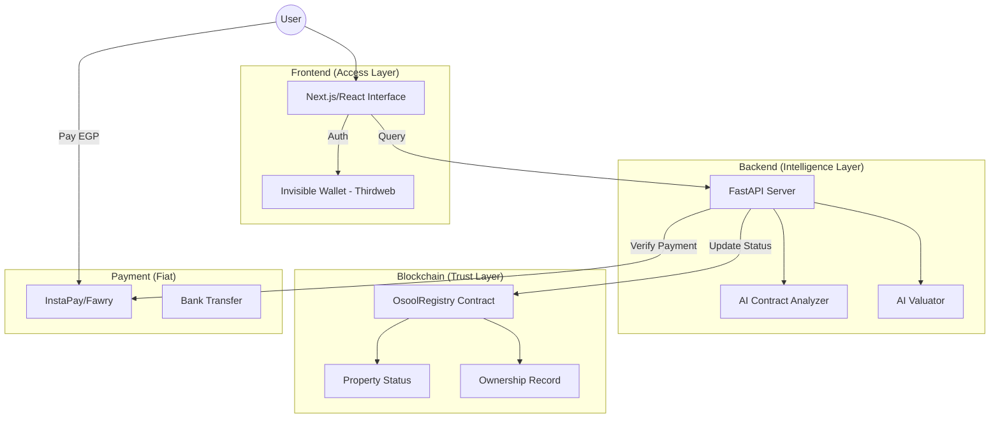

# Osool (أصول) | State-of-the-Art Real Estate Platform

**Osool** is a next-generation marketplace designed for the **Egyptian Real Estate Market**. It solves the two critical failures of existing platforms: **Lack of Trust** and **Price Volatility**.

> **CBE Law 194 Compliant**: All monetary transactions flow through EGP channels (InstaPay/Fawry). Blockchain stores **status and ownership records only** — no cryptocurrency payments.

---

## 🏗️ Architecture: "Blockchain = Truth, Fiat = Money"



---

## 🚀 Key Features

| Feature | Market Gap | Osool Solution |
|---------|-----------|----------------|
| **Trust** | Handshakes & Cash → Fraud | **Blockchain Registry** - Immutable status records |
| **Pricing** | Random seller prices | **AI Valuation** - Fair price with reasoning |
| **Legal Safety** | Hidden contract traps | **AI Legal Check** - Scans for Egyptian law risks |
| **Double Selling** | Same unit sold twice | **On-chain Status** - Reserved = Locked |

---

## 📁 Repository Structure

```
Osool/
├── .github/workflows/     # CI/CD Pipeline
├── contracts/             # Solidity Smart Contracts
│   ├── OsoolRegistry.sol  # Legal-compliant property registry
│   ├── ElitePropertyEscrow.sol
│   └── EliteSubscriptionToken.sol
├── backend/               # Python FastAPI
│   ├── app/
│   │   ├── ai_engine/     # OpenAI-powered analysis
│   │   ├── api/           # REST endpoints
│   │   └── services/      # Blockchain service
│   └── requirements.txt
├── public/                # Static frontend
├── web/                   # Next.js frontend
├── test/                  # Hardhat tests
└── scripts/               # Deployment scripts
```

---

## 🛠️ Quick Start

### 1. Smart Contracts

```bash
# Install dependencies
npm install

# Compile contracts
npx hardhat compile

# Run tests
npx hardhat test

# Deploy to Polygon Amoy testnet
npx hardhat run scripts/deploy.js --network amoy
```

### 2. Python Backend

```bash
cd backend

# Create virtual environment
python -m venv venv
venv\Scripts\activate  # Windows

# Install dependencies
pip install -r requirements.txt

# Run server
uvicorn app.main:app --reload
```

### 3. API Endpoints

| Endpoint | Method | Description |
|----------|--------|-------------|
| `/api/health` | GET | Health check |
| `/api/reserve` | POST | Reserve property (after EGP payment) |
| `/api/finalize-sale` | POST | Complete sale (after bank transfer) |
| `/api/ai/analyze-contract` | POST | AI legal contract analysis |
| `/api/ai/valuation` | POST | AI property valuation |
| `/api/ai/compare-price` | POST | Compare asking price vs. market |

---

## 🔐 Environment Variables

Create `.env` in project root:

```env
# Blockchain
PRIVATE_KEY=your_deployer_private_key
POLYGON_RPC_URL=https://rpc-amoy.polygon.technology/
OSOOL_REGISTRY_ADDRESS=0x...

# AI
OPENAI_API_KEY=sk-proj-...
```

---

## 🧪 Testing

```bash
# Smart Contracts
npx hardhat test

# Backend (syntax check)
cd backend && python -m compileall app/
```

---

## 📋 Roadmap

- [x] Legal-compliant blockchain registry
- [x] AI contract analysis (Egyptian law)
- [x] AI property valuation
- [x] CI/CD pipeline
- [ ] Account abstraction (gasless UX)
- [ ] Mobile app (React Native)
- [ ] FRA 125 fractional ownership

---

## 📜 Legal Compliance

- **CBE Law 194/2020**: No cryptocurrency trading — EGP payments only
- **FRA Decision 125/2025**: Ready for digital real estate funds
- **Civil Code 131**: AI trained on Egyptian contract law

---

## 👥 Contributing

Contributions welcome. See `CONTRIBUTING.md` for guidelines.

**Lead Engineer:** Mustafa  
**Mission:** Building the future of Egyptian Asset Management

---

## 📄 License

MIT License - See [LICENSE](LICENSE) for details.
