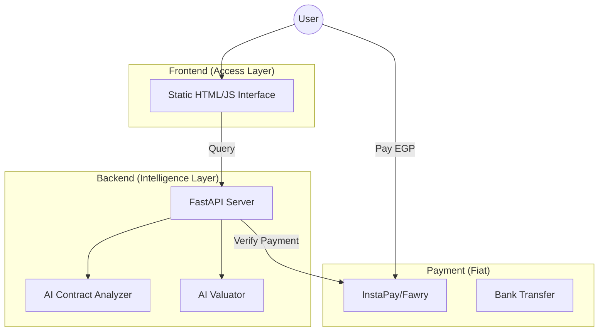

# Osool (أصول) | State-of-the-Art Real Estate Platform

**Osool** is a next-generation marketplace designed for the **Egyptian Real Estate Market**. It solves the two critical failures of existing platforms: **Lack of Trust** and **Price Volatility**.

> **CBE Law 194 Compliant**: All monetary transactions flow through EGP channels (InstaPay/Fawry).

---

## 🏗️ Architecture


```mermaid
graph TD
    User((User))
    
    subgraph "Frontend (Access Layer)"
        UI[Static HTML/JS Interface]
    end

    subgraph "Backend (Intelligence Layer)"
        API[FastAPI Server]
        LegalAI[AI Contract Analyzer]
        PriceAI[AI Valuator]
    end

    subgraph "Payment (Fiat)"
        InstaPay[InstaPay/Fawry]
        Bank[Bank Transfer]
    end

    User --> UI
    UI -->|Query| API
    API --> LegalAI
    API --> PriceAI
    User -->|Pay EGP| InstaPay
    API -->|Verify Payment| InstaPay
```

---

## 🚀 Key Features

| Feature | Market Gap | Osool Solution |
|---------|-----------|----------------|
| **Trust** | Handshakes & Cash → Fraud | **Verified Registry** - Immutable status records |
| **Pricing** | Random seller prices | **AI Valuation** - Fair price with reasoning |
| **Legal Safety** | Hidden contract traps | **AI Legal Check** - Scans for Egyptian law risks |
| **Double Selling** | Same unit sold twice | **Status Tracking** - Reserved = Locked |

---

## 📁 Repository Structure

```
Osool/
├── .github/workflows/     # CI/CD Pipeline
├── backend/               # Python FastAPI
│   ├── app/
│   │   ├── ai_engine/     # OpenAI-powered analysis
│   │   ├── api/           # REST endpoints
│   │   └── services/      # Business services
│   └── requirements.txt
├── public/                # Static frontend
├── web/                   # Next.js frontend
└── scripts/               # Utility scripts
```

---

## 🛠️ Quick Start

### 1. Python Backend

```bash
cd backend

# Create virtual environment
python -m venv venv
venv\Scripts\activate  # Windows
# source venv/bin/activate  # Linux/Mac

# Install dependencies
pip install -r requirements.txt

# Run server
uvicorn app.main:app --reload
```

### 2. Data Ingestion (CRITICAL - AI Brain)

The AI Sales Agent cannot function without property data in the vector store.

```bash
cd backend

# 1. Ensure .env has these variables:
#    SUPABASE_URL=your_supabase_url
#    SUPABASE_KEY=your_supabase_key
#    OPENAI_API_KEY=your_openai_key

# 2. Run data ingestion (parses property data into Supabase)
python ingest_data.py

# 3. Verify the vector store is working
python verify_vector_store.py
```

### 3. Verify Health

```bash
# Check API is running
curl http://localhost:8000/api/health
# Expected: {"status": "healthy", ...}

# Test AI Chat (after data ingestion)
curl -X POST http://localhost:8000/api/chat \
  -H "Content-Type: application/json" \
  -d '{"message": "Show me villas in New Cairo", "session_id": "test123"}'
```

### 4. API Endpoints

| Endpoint | Method | Description |
|----------|--------|-------------|
| `/api/health` | GET | Health check |
| `/api/chat` | POST | AI Sales Agent chat |
| `/api/reserve` | POST | Reserve property (after EGP payment) |
| `/api/finalize-sale` | POST | Complete sale (after bank transfer) |
| `/api/ai/analyze-contract` | POST | AI legal contract analysis |
| `/api/ai/valuation` | POST | AI property valuation |
| `/api/ai/compare-price` | POST | Compare asking price vs. market |
| `/api/fractional/invest` | POST | Fractional property investment |

---

## 🔐 Environment Variables

Create `.env` in `backend/` directory:

```env
# AI
OPENAI_API_KEY=sk-proj-...
ANTHROPIC_API_KEY=sk-ant-api03-...

# Security
JWT_SECRET_KEY=...
ADMIN_API_KEY=...

# Database
DATABASE_URL=postgresql://...
```

---

## 🧪 Testing

```bash
# Backend (syntax check)
cd backend && python -m compileall app/
```

---

## 📋 Roadmap

- [x] AI contract analysis (Egyptian law)
- [x] AI property valuation
- [x] CI/CD pipeline
- [ ] Mobile app (React Native)
- [ ] FRA 125 fractional ownership

---

## 📜 Legal Compliance

- **CBE Law 194/2020**: No cryptocurrency trading — EGP payments only
- **FRA Decision 125/2025**: Ready for digital real estate funds
- **Civil Code 131**: AI trained on Egyptian contract law

---

## 👥 Contributing

Contributions welcome. See `CONTRIBUTING.md` for guidelines.

**Lead Engineer:** Mustafa  
**Mission:** Building the future of Egyptian Asset Management

---

## 📄 License

MIT License - See [LICENSE](LICENSE) for details.
