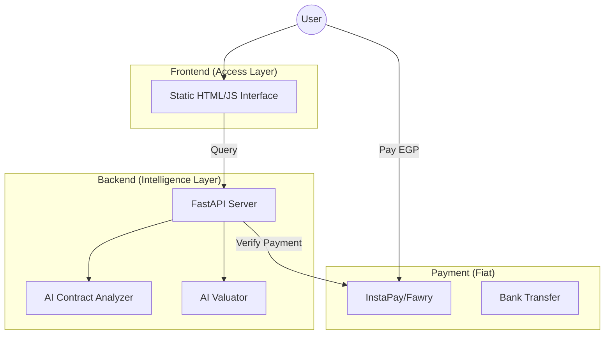

# Osool (أصول) | State-of-the-Art Real Estate Platform

**Osool** is a next-generation marketplace designed for the **Egyptian Real Estate Market**. It solves the two critical failures of existing platforms: **Lack of Trust** and **Price Volatility**.

> **CBE Law 194 Compliant**: All monetary transactions flow through EGP channels (InstaPay/Fawry).

---

## 🏗️ Architecture


```mermaid
graph TD
    User((User))
    
    subgraph "Frontend (Access Layer)"
        UI[Static HTML/JS Interface]
    end

    subgraph "Backend (Intelligence Layer)"
        API[FastAPI Server]
        LegalAI[AI Contract Analyzer]
        PriceAI[AI Valuator]
    end

    subgraph "Payment (Fiat)"
        InstaPay[InstaPay/Fawry]
        Bank[Bank Transfer]
    end

    User --> UI
    UI -->|Query| API
    API --> LegalAI
    API --> PriceAI
    User -->|Pay EGP| InstaPay
    API -->|Verify Payment| InstaPay
```

---

## 🚀 Key Features

| Feature | Market Gap | Osool Solution |
|---------|-----------|----------------|
| **Trust** | Handshakes & Cash → Fraud | **Verified Registry** - Immutable status records |
| **Pricing** | Random seller prices | **AI Valuation** - Fair price with reasoning |
| **Legal Safety** | Hidden contract traps | **AI Legal Check** - Scans for Egyptian law risks |
| **Double Selling** | Same unit sold twice | **Status Tracking** - Reserved = Locked |

---

## 📁 Repository Structure

```
Osool/
├── .github/workflows/     # CI/CD Pipeline
├── backend/               # Python FastAPI
│   ├── app/
│   │   ├── ai_engine/     # OpenAI-powered analysis
│   │   ├── api/           # REST endpoints
│   │   └── services/      # Business services
│   └── requirements.txt
├── public/                # Static frontend
├── web/                   # Next.js frontend
└── scripts/               # Utility scripts
```

---

## 🛠️ Quick Start

### 1. Infrastructure (Postgres + Redis)

Backend needs both running locally before it can boot.

```bash
docker compose up -d postgres redis
```

### 2. Python Backend

```bash
cd backend

# Create virtual environment
python -m venv venv
venv\Scripts\activate  # Windows
# source venv/bin/activate  # Linux/Mac

# Install dependencies
pip install -r requirements.txt

# Copy env template and fill in keys (OPENAI_API_KEY, ANTHROPIC_API_KEY,
# JWT_SECRET_KEY, ADMIN_API_KEY are the minimum needed to boot)
copy ..\.env.example .env

# Apply migrations
alembic upgrade head

# Run server (port 8000)
uvicorn app.main:app --reload
```

### 3. Next.js Frontend

In a second terminal:

```bash
cd web
npm install
npm run dev          # port 3000
```

Open http://localhost:3000.

### 4. Seed Property Data (optional, for AI chat to return real listings)

```bash
cd backend
python ingest_data.py            # pulls scraped properties into pgvector
python verify_vector_store.py    # sanity-check embeddings
```

### 5. Verify Health

```bash
curl http://localhost:8000/api/health
# Expected: {"status": "healthy", ...}
```

### 6. API Endpoints (verified 2026-05-26)

Public:

| Endpoint | Method | Description |
|----------|--------|-------------|
| `/api/health`, `/api/ready`, `/api/liveness` | GET | Health probes |
| `/api/v1/chat`, `/api/v1/chat/stream` | POST | AI chat (authenticated) |
| `/api/valuation/npv` | POST | NPV flattening of payment plans |
| `/api/valuation/normalize` | POST | Price/sqm normalization |
| `/api/valuation/la2ta` | POST | Underpriced-resale detector |
| `/api/auth/register`, `/login`, `/refresh`, `/google` | POST | Auth flows |
| `/webhook/paymob` | POST | Paymob payment webhook (HMAC-signed) |

Admin (requires `X-API-Key` matching `ADMIN_API_KEY`):

| Endpoint | Description |
|----------|-------------|
| `/admin/*` (55 endpoints) | Users, leads, tickets, analytics, SEO |
| `/api/ingest` | Trigger property ingestion |
| `/metrics` | Prometheus metrics |

See `CLAUDE.md` for the full architecture map and `backend/app/api/` for source.

---

## 🔐 Environment Variables

Create `.env` in `backend/` directory:

```env
# AI
OPENAI_API_KEY=sk-proj-...
ANTHROPIC_API_KEY=sk-ant-api03-...

# Security
JWT_SECRET_KEY=...
ADMIN_API_KEY=...

# Database
DATABASE_URL=postgresql://...
```

---

## 🚀 Production Deployment

### Current Targets

- Frontend (Next.js): Vercel (`https://osool-ten.vercel.app`)
- Backend (FastAPI): Railway (`https://osool-production.up.railway.app`)

### Deploy Frontend (Vercel)

```bash
cd Osool-Platform
vercel deploy --prod --yes
```

### Deploy Backend (Railway)

```bash
cd Osool-Platform
railway up --ci
```

### Production Health Checks

```powershell
Invoke-WebRequest -Uri "https://osool-ten.vercel.app/chat" -UseBasicParsing -TimeoutSec 20
Invoke-WebRequest -Uri "https://osool-production.up.railway.app/health" -UseBasicParsing -TimeoutSec 20
```

Expected results:

- Vercel chat page returns `200`
- Railway health returns `200` with `{"status":"healthy",...}`

### Chat Stream Validation (New Path)

The chat stream path now uses a same-origin Next.js proxy (`/api/chat/stream`) that bootstraps CSRF before forwarding to backend stream endpoints.

Validated production behavior:

- Stream request completes successfully
- Local free route markers are present in stream payload/UI
- No browser-side CSRF mismatch on the user chat path

### Post-Release Validation Workflow (May 2026)

Use this sequence after shipping chat-path updates:

```bash
# 1) Push code/docs
git add .
git commit -m "docs: update production validation and chat-path checks"
git push origin main
```

```bash
# 2) Railway production deploy/verify
railway up --ci
railway status
```

```bash
# 3) Vercel production deploy (project: osool)
vercel deploy --prod --yes
```

```powershell
# 4) Endpoint checks
Invoke-WebRequest -Uri "https://osool-ten.vercel.app/chat" -UseBasicParsing -TimeoutSec 20
Invoke-WebRequest -Uri "https://osool-production.up.railway.app/health" -UseBasicParsing -TimeoutSec 20
```

Expected:

- Vercel `/chat` returns `200`
- Railway `/health` returns `200` and `{"status":"healthy",...}`

### Playwright Acceptance Check (Business Scenario)

On production `/chat`, verify the user can clearly see whether they are in free mode or consultant handoff mode:

1. Start a new conversation.
2. Send a free-path query: `I need an apartment in New Cairo for 8 million and 3 rooms`.
3. Confirm free mode UI appears (banner and/or route badge), including remaining free quota.
4. Send a complex-intent query: `I need a macro forecast for New Cairo prices under inflation and currency risk for the next 3 years`.
5. Confirm consultant handoff UI appears with visible CTA actions (`Talk to Consultant`, `Unlock Premium`).

---

## 🧪 Testing

```bash
# Backend (syntax check)
cd backend && python -m compileall app/
```

```bash
# Frontend production build
cd web && npm run build
```

---

## 📋 Roadmap

- [x] AI contract analysis (Egyptian law)
- [x] AI property valuation
- [x] CI/CD pipeline
- [ ] Mobile app (React Native)
- [ ] FRA 125 fractional ownership

---

## 📜 Legal Compliance

- **CBE Law 194/2020**: No cryptocurrency trading — EGP payments only
- **FRA Decision 125/2025**: Ready for digital real estate funds
- **Civil Code 131**: AI trained on Egyptian contract law

---

## 👥 Contributing

This is a closed-source product. Internal contributors follow conventional commits
(`feat:`, `fix:`, `chore:`, etc.) and target the `main` branch via PR.

**Lead Engineer:** Mustafa
**Mission:** Building the future of Egyptian Asset Management
